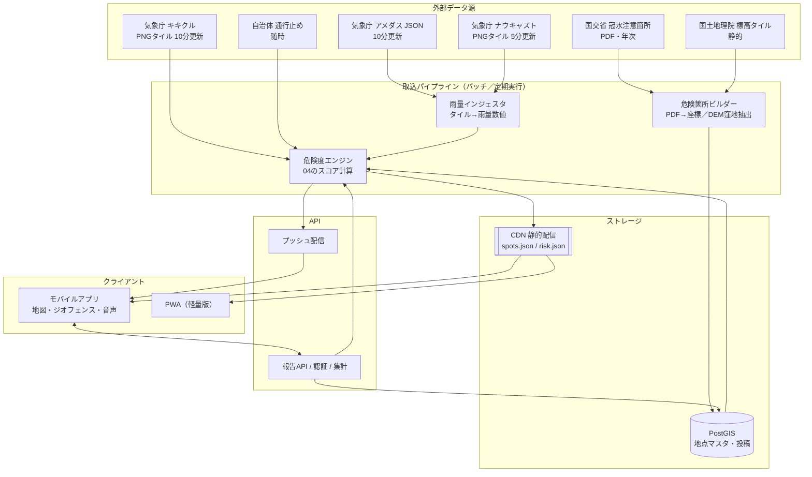

# 05. システム設計

作成日: 2026-08-19

---

## 1. 全体構成



### 設計の要点

1. **読み取りはDBを経由しない。** 危険度は5分ごとに再計算して **静的JSONとしてCDNに置く**。
   豪雨時にアクセスが数十倍になっても、CDNが吸収する。DBが落ちてもアプリは動く。
2. **書き込み（投稿）だけがAPIを通る。** ここだけスケールを気にすればよい。
3. **外部データ源はすべてアダプタで隔離する。** 気象庁のJSON/タイルは公式APIではなく仕様変更がありうるため、
   取得失敗を前提に **「前回値の保持＋鮮度表示＋劣化動作」** を実装する。

---

## 2. 技術選定

| レイヤ | 採用 | 理由 |
|-------|------|------|
| モバイル | **React Native + Expo** | iOS/Android同時開発。`expo-location`（ジオフェンス）、`expo-task-manager`（バックグラウンド）、`expo-notifications`、`expo-speech`（音声）が揃っており、必要な機能がほぼ Expo API だけで実現できる |
| 地図（アプリ） | **MapLibre React Native** | OSS、ラスタタイル（地理院・気象庁）をそのまま重ねられる |
| 地図（Web） | **MapLibre GL JS** | 同上。プロトタイプはこちら |
| ベースマップ | **地理院タイル** | 無料・災害時の定番・出典表示のみで利用可 |
| バックエンド | **Cloudflare Workers + D1/R2** もしくは **Supabase** | 定期実行（Cron Triggers）とCDN配信が同居する。個人開発〜小規模運用のコストが低い |
| 地理空間DB | **PostGIS**（Supabase）／ 初期は GeoJSON + R-tree で十分 | 近傍検索・ポリゴン判定 |
| 取込バッチ | **Python**（`Pillow` でタイル画素読み、`geopandas`） | 画像処理と地理処理のライブラリが揃う |
| プッシュ | Expo Push / FCM・APNs | |
| ルーティング（P2） | **Valhalla** または OpenRouteService | **avoid polygon（回避エリア指定）に対応**していることが必須条件。OSRMは高速だが回避エリアが苦手 |

---

## 3. データモデル

### 3-1. `spots`（危険箇所マスタ）

```jsonc
{
  "id": "chiba-underpass-0042",
  "name": "○○地下道",
  "kind": "underpass_gravity",          // underpass_pump | underpass_gravity | lowland | river_adjacent | bridge_approach
  "geometry": { "type": "Point", "coordinates": [140.1234, 35.6001] },
  "extent":   { "type": "LineString", "coordinates": [[...],[...]] },   // 区間として持つ場合
  "road": { "name": "国道○号", "admin": "国交省千葉国道事務所" },
  "params": {
    "t60": 23.3,            // 04-3 で算出した冠水閾値 (mm/h)
    "t60_source": "default+dem+history",
    "t_burst": 32.6,
    "dz": -1.8,             // 周辺100mとの相対標高 (m)
    "hist": 3
  },
  "evidence": {
    "source": "国交省 道路冠水注意箇所マップ（2026-06-30版）",
    "confidence": 1.0,
    "verified_at": "2026-08-19"
  },
  "notes": "夜間は水面が見えにくい。過去に車両水没あり"
}
```

### 3-2. `risk`（5分ごとに再生成される危険度スナップショット）

```jsonc
{
  "generated_at": "2026-08-19T14:35:00+09:00",
  "valid_until":  "2026-08-19T14:45:00+09:00",
  "source_freshness": { "amedas": "14:30", "nowcast": "14:35", "kikikuru": "14:30" },
  "spots": {
    "chiba-underpass-0042": {
      "level": 3, "score": 68,
      "rain": { "r10": 9.2, "r60": 41.0, "r180": 88.0, "f30": 12.0 },
      "kikikuru": 2,
      "reason": "時間雨量41mm（閾値23mm）＋先行降雨88mm"   // 説明可能性のために必ず持つ
    }
  }
}
```

> `reason` を必ず持たせる。「なぜ危険と言われたか」が分からない通知は信用されない。

### 3-3. `reports`（ユーザー投稿）

```jsonc
{
  "id": "rpt_01H...",
  "spot_id": "chiba-underpass-0042",     // null なら新規地点候補
  "location": [140.1234, 35.6001],
  "gps_accuracy_m": 12,
  "depth": "knee",                        // ankle | knee | above_knee | car_submerged | cleared
  "photo_url": "r2://...",
  "device_hash": "...",                   // 個人特定しないレート制限用
  "created_at": "2026-08-19T14:31:00+09:00",
  "confirmations": 2, "denials": 0,
  "weight": 0.72                          // 04-5 の U に寄与する重み
}
```

### 3-4. 配信ファイル構成（CDN）

```
/v1/spots/chiba.json          … 危険箇所マスタ（変更時のみ更新、ETag/長期キャッシュ）
/v1/spots/chiba.pmtiles       … 全国展開時のベクタタイル
/v1/risk/latest.json          … 全国の危険度（5分更新、短期キャッシュ）
/v1/risk/{meshcode}.json      … メッシュ分割版（大規模化した場合）
/v1/reports/recent.json       … 直近3時間の有効な投稿（1分更新）
/v1/legend/nowcast.json       … ナウキャストPNGの色→雨量 対応表
```

---

## 4. 取込パイプライン

### 4-1. 雨量インジェスタ（5分ごと）

```
1. GET .../jmatile/data/nowc/targetTimes_N1.json   → 最新の basetime / validtime
2. 対象エリアのタイル (z=10) を取得
     .../nowc/{basetime}/none/{validtime}/surf/hrpns/{z}/{x}/{y}.png
3. Pillow で読み、legend/nowcast.json の RGB→階級表で雨量強度に変換
4. GET .../amedas/data/latest_time.txt → .../amedas/data/map/{ymdhms}.json
5. 地点ごとに IDW 内挿 + タイル値を合成（04-2）
6. R10 / R60 / R180 / F30 を時系列テーブルに書き込み
```

**失敗時**: 前回値を保持し、`source_freshness` を古いまま返す。
クライアントは鮮度が15分以上古い場合、画面に「情報が最新ではありません」と明示する。

### 4-2. 危険箇所ビルダー（不定期・手動起動）

```
[公的PDF ルート]
  PDF → テキスト/表抽出 → 住所・交差点名 → ジオコーディング
      → 人手レビュー（★必須）→ spots へ登録（confidence=1.0）

[DEM 窪地抽出ルート]
  標高タイル(DEM5A/10B) → 道路中心線(OSM)上に一定間隔でサンプリング
      → 各点の標高 - 半径100m内の道路上標高の中央値 = dz
      → dz < -1.0m かつ 排水路から遠い点 をクラスタリング → 危険箇所候補（confidence=0.5）
      → 「候補」として別スタイルで表示、投稿で裏が取れたら昇格

[OSM ルート]
  tunnel=yes / layer<0 かつ highway=* → アンダーパス候補
```

> **人手レビューは省略しない。** 誤った地点を「危険」と表示することは、
> 見逃しとは別種の害（信頼失墜・不要な迂回）を生む。

### 4-3. 危険度エンジン（5分ごと）

[04](04_危険度判定ロジック.md) の計算を全地点に適用し、`risk/latest.json` を生成してCDNへPUT。
レベルが上がった地点は、プッシュ配信キューに積む。

---

## 5. クライアント設計

### 5-1. ジオフェンスの張り替え（OS制約への対処）

**iOSは同時20件、Androidは100件**というOS上限がある。全危険箇所を常時監視することはできない。

```
戦略: 「動的リフレッシュ型ジオフェンス」

1. 起動時／大きく移動したとき（significant-location-change）に発火
2. 現在地から近い順に、レベル2以上の地点を最大 N 件選ぶ
   （iOS: N=18、残り2枠は「再張り替えトリガ用の広域フェンス」に使う）
3. 各地点に半径 300m（市街地）／500m（郊外・高速）のフェンスを登録
4. 現在地から見て最も遠いフェンスの外側に、半径 3km の「再計算フェンス」を1つ張る
   → そこを出たら 2. からやり直す
5. 危険度が下がった地点はフェンスを解除する
```

- これにより **常時高精度測位を行わずに** 接近アラートが成立し、電池消費を抑えられる。
- ナビ利用中（ユーザーが明示的に「走行モード」をONにした間）だけ、
  `watchPosition` による連続測位に切り替え、進行方向判定（F-21）を有効化する。

### 5-2. オフライン対応

| データ | 保持方法 | 有効期間 |
|-------|---------|---------|
| 危険箇所マスタ | 端末DB（SQLite）に全件保存 | 無期限（更新は差分） |
| ベースマップ | 現在地周辺のタイルを事前キャッシュ（オプションで市域一括DL） | 30日 |
| 危険度スナップショット | 最新1件を保存 | 取得時刻を明示して表示 |
| 投稿 | 送信キューに積み、オンライン復帰時に送信 | — |

**圏外でも、危険箇所マスタ＋最後に取得した危険度で接近アラートは鳴る。**
その際は通知に「（○時○分時点の情報）」を必ず付ける。

### 5-3. 走行中のUI

- 画面操作は要求しない。通知は**音声（`expo-speech`）＋大きな1画面**のみ。
- 文言テンプレート: 「**{距離}先、{地点種別}。{レベル文言}。**」
  例: 「500メートル先、地下道。冠水の可能性が高い場所です。」
- 「引き返す／迂回する」は**停車後**に操作させる。走行中は選択肢を出さない。
- CarPlay / Android Auto 対応は P3。

---

## 6. 監視と運用

| 監視項目 | 閾値 | 対応 |
|---------|------|------|
| 雨量取込の連続失敗 | 3回（15分） | アラート。クライアントは鮮度警告を表示 |
| 気象庁レスポンスの形式変化 | スキーマ検証NG | 取込停止＋通知（誤った雨量で誤報を出さないため） |
| CDN配信の遅延 | `generated_at` が10分以上前 | アラート |
| 通知送信数 | 平常時の20倍 | 通知予算のスロットリングを発動 |
| 投稿の急増 | 平常時の50倍 | 自動モデレーション強化＋人手確認 |

**豪雨イベント時の運用体制**（P2以降）: 大雨警報が出たエリアについては、
投稿のレビューを行う当番を置くか、AIによる写真の自動判定（冠水しているか否か）を併用する。

---

## 7. コスト概算（MVP・千葉県のみ・月間MAU 5,000想定）

| 項目 | 月額目安 |
|------|---------|
| Cloudflare Workers + R2 + CDN | 0〜1,000円（無料枠内に収まる可能性が高い） |
| Supabase（PostGIS・投稿・写真） | 0〜3,000円 |
| プッシュ通知（Expo/FCM） | 0円 |
| 地図タイル | 0円（地理院・気象庁。**出典表示が条件**） |
| ジオコーディング（初期のPDF座標化） | 数千円（1回きり） |
| **合計** | **月 5,000円以内で開始できる** |

有償のXRAIN・河川情報センター配信は、自治体連携や商用化のフェーズで検討する。
